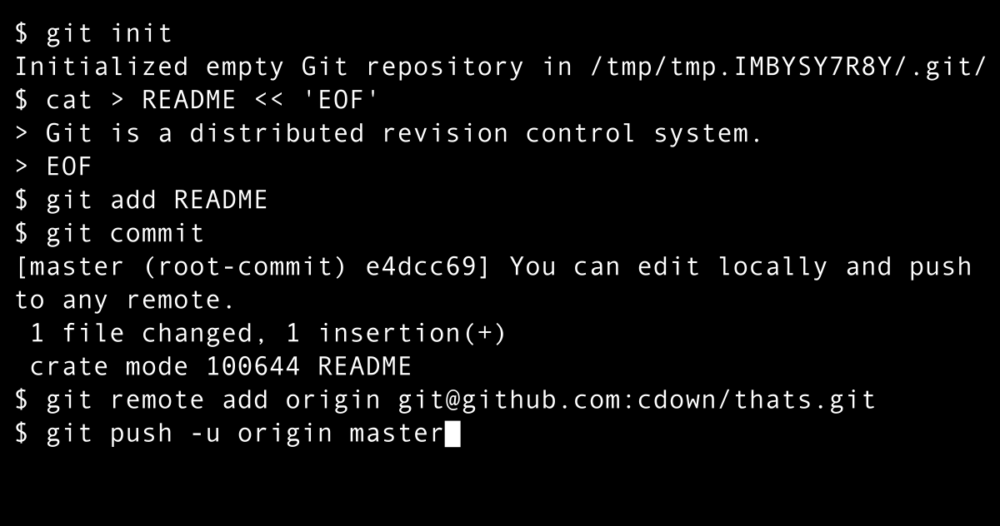

# Mixed Messages and Git

## Description
 
 - Project Goal
  
The aim for this project was to create a message that everytime the code was ran would produce random words or numbers to create a different message. To build your knowledge of git and github.

- Why did I do this?
  
This was part of the Codecademy full stack programming course to help put learning into practice, using your own initiative and problem solving skills to code and to help improve your understanding of git and github.

## How to use 
Simply just run the code and the function will be called upon and display the message within the console.

## Technologies needed

One of the following to see the code:

1. Web browser console
2. VS Code (with node installed)
3. Codecademy workspace
4. Or another type of coding workspace
   

